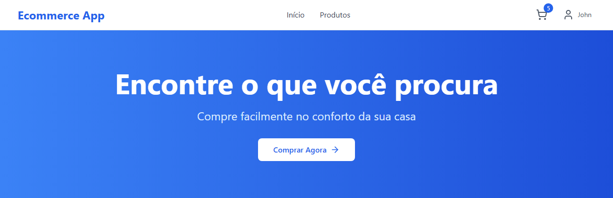

# Ecommerce App

Aplicação full stack de loja virtual com .NET, React, PostgreSQL e Docker.

<div>
    
</div>

## Tecnologias

**Backend**: ASP.NET Core, Entity Framework, MediatR/CQRS, XUnit  
**Frontend**: React, Vite, Tailwind CSS, Vitest  
**DevOps**: Docker Compose, GitHub Actions, SonarQube

## Executar o Projeto

```bash
# Configurar
npm run setup
# Iniciar os containers
npm run docker

# desenvolvimento local
npm run dev
```

**Links:**

- Frontend: http://localhost:5173
- API: http://localhost:7000/swagger # Docker

### Automação e Setup

```bash
npm run setup
npm run build
npm run test
npm run dev
npm run docker
npm run clean
npm run quality
```

## Estrutura

### Backend

- Domain: Entidades e regras de negócio
- Application: Casos de uso (CQRS)
- Infrastructure: Dados e serviços
- Api: Controllers e configuração
- Tests: Testes unitários

### Frontend

- components: Componentes reutilizáveis
- pages: Páginas da aplicação
- context: Context API, estado global
- services: Integração com API

### Banco de dados

- Usuários e Autenticação: Users, Customers
- Catálogo de Produtos: Categories, Products
- Sistema de Pedidos: Orders, OrderItems
- Pagamentos e Envio: Payments, Shipments

Projeto demonstrativo com foco em Clean Architecture, DDD e padrões modernos.
